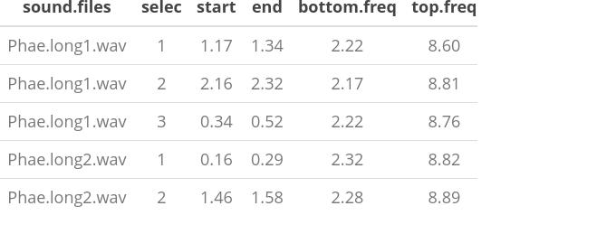

 

::: {.alert .alert-info}
## **Objetive** {.unnumbered .unlisted}

-   Provide and overview of the must relevant tools in the package warbleR
:::

 

The [warbleR](https://cran.r-project.org/package=warbleR) package is intended to facilitate the analysis of the structure of animal acoustic signals in R. Users can enter their own data into a workflow that facilitates spectrographic visualization and measurement of acoustic parameters **warbleR** makes use of the fundamental sound analysis tools of the **seewave** package, and offers new tools for acoustic structure analysis. These tools are available for batch analysis of acoustic signals.

 

<font size = "4">The main features of the package are:</font>

<font size = "3">

-   The use of loops to apply tasks through acoustic signals referenced in a selection table:

 



 

-   The production of images files with spectrograms that let users organize data and verify acoustic analyzes: </font>

 


 

The package offers functions for:

-   Browse and download recordings of [Xeno ‐ Canto](https://xeno-canto.org/)
-   Explore, organize and manipulate multiple sound files
-   Detect signals automatically (in frequency and time)
-   Create spectrograms of complete recordings or individual signals
-   Run different measures of acoustic signal structure
-   Evaluate the performance of measurement methods
-   Catalog signals
-   Characterize different structural levels in acoustic signals
-   Statistical analysis of duet coordination
-   Consolidate databases and annotation tables

Most functions allow the parallelization of tasks, which distributes the tasks among several cores to improve computational efficiency. Tools to evaluate the performance of the analysis at each step are also available. All these tools are provided in a standardized workflow for the analysis of the signal structure, making them accessible to a wide range of users, including those without much knowledge of R.

**warbleR** is a package (officially published in 2017) currently in a maturation stage:


 

# Selection tables

These objects are created with the `selection_table()` function. The function takes data frames containing selection data (name of the sound file, selection, start, end ...), verifies if the information is consistent (see the function `check_sels()` for details) and saves the 'diagnostic' metadata as an attribute. The selection tables are basically data frames in which the information contained has been corroborated so it can be read by other **warbleR** functions. The selection tables must contain (at least) the following columns:

1.  sound files (sound.files)
2.  selection (select)
3.  start
4.  end

The sample data "lbh_selec_table" contains these columns:


::: {.cell}

:::

::: {.cell}

```{.r .cell-code}
data("lbh_selec_table")

lbh_selec_table
```

::: {.cell-output-display}
<div class="kable-table">

|sound.files    | channel| selec|     start|       end| bottom.freq|  top.freq|
|:--------------|-------:|-----:|---------:|---------:|-----------:|---------:|
|Phae.long1.wav |       1|     1| 1.1693549| 1.3423884|    2.220105|  8.604378|
|Phae.long1.wav |       1|     2| 2.1584085| 2.3214565|    2.169437|  8.807053|
|Phae.long1.wav |       1|     3| 0.3433366| 0.5182553|    2.218294|  8.756604|
|Phae.long2.wav |       1|     1| 0.1595983| 0.2921692|    2.316862|  8.822316|
|Phae.long2.wav |       1|     2| 1.4570585| 1.5832087|    2.284006|  8.888027|
|Phae.long3.wav |       1|     1| 0.6265520| 0.7577715|    3.006834|  8.822316|
|Phae.long3.wav |       1|     2| 1.9742132| 2.1043921|    2.776843|  8.888027|
|Phae.long3.wav |       1|     3| 0.1233643| 0.2545812|    2.316862|  9.315153|
|Phae.long4.wav |       1|     1| 1.5168116| 1.6622365|    2.513997|  9.216586|
|Phae.long4.wav |       1|     2| 2.9326920| 3.0768784|    2.579708| 10.235116|
|Phae.long4.wav |       1|     3| 0.1453977| 0.2904966|    2.579708|  9.742279|

</div>
:::
:::


 

... and can be converted to the *selection_table* format like this:


::: {.cell}

```{.r .cell-code}
# global parameters
warbleR_options(wav.path = "./examples")

st <- selection_table(X = lbh_selec_table, pb = FALSE)

st
```
:::

::: {.cell}
::: {.cell-output .cell-output-stderr}

```
all selections are OK 
```


:::

::: {.cell-output-display}
<div class="kable-table">

|sound.files    | channel| selec|     start|       end| bottom.freq|  top.freq|
|:--------------|-------:|-----:|---------:|---------:|-----------:|---------:|
|Phae.long1.wav |       1|     1| 1.1693549| 1.3423884|    2.220105|  8.604378|
|Phae.long1.wav |       1|     2| 2.1584085| 2.3214565|    2.169437|  8.807053|
|Phae.long1.wav |       1|     3| 0.3433366| 0.5182553|    2.218294|  8.756604|
|Phae.long2.wav |       1|     1| 0.1595983| 0.2921692|    2.316862|  8.822316|
|Phae.long2.wav |       1|     2| 1.4570585| 1.5832087|    2.284006|  8.888027|
|Phae.long3.wav |       1|     1| 0.6265520| 0.7577715|    3.006834|  8.822316|
|Phae.long3.wav |       1|     2| 1.9742132| 2.1043921|    2.776843|  8.888027|
|Phae.long3.wav |       1|     3| 0.1233643| 0.2545812|    2.316862|  9.315153|
|Phae.long4.wav |       1|     1| 1.5168116| 1.6622365|    2.513997|  9.216586|
|Phae.long4.wav |       1|     2| 2.9326920| 3.0768784|    2.579708| 10.235116|
|Phae.long4.wav |       1|     3| 0.1453977| 0.2904966|    2.579708|  9.742279|

</div>
:::
:::


Note that the path to the sound files has been provided. This is necessary in order to verify that the data provided conforms to the characteristics of the audio files.

Selection tables have their own class in R:


::: {.cell}

```{.r .cell-code}
class(st)
```

::: {.cell-output .cell-output-stdout}

```
[1] "selection_table" "data.frame"     
```


:::
:::


 

## Extended selection tables

When the `extended = TRUE` argument the function generates an object of the *extended_selection_table* class that also contains a list of 'wave' objects corresponding to each of the selections in the data. Therefore, the function **transforms the selection table into self-contained objects** since the original sound files are no longer needed to perform most of the acoustic analysis in **warbleR**. This can greatly facilitate the storage and exchange of (bio)acoustic data. In addition, it also speeds up analysis, since it is not necessary to read the sound files every time the data is analyzed.

Now, as mentioned earlier, you need the `selection_table()` function to create an extended selection table. You must also set the argument `extended = TRUE` (otherwise, the class would be a selection table). The following code converts the sample data into an extended selection table:


::: {.cell}

```{.r .cell-code}
#  global parameters
warbleR_options(wav.path = "./examples")

ext_st <- selection_table(X = lbh_selec_table, pb = FALSE, 
          extended = TRUE)
```
:::

::: {.cell}
::: {.cell-output .cell-output-stderr}

```
all selections are OK 
```


:::
:::


 

And that is. Now the acoustic data and the selection data (as well as the additional metadata) are all together in a single R object.

 

::: {.alert .alert-info}
<font size="5">Exercise</font>

 

-   Run the example code in the `selection_table()` function documentation

-   What do the arguments "mar", "by.song" and "whole.recs" do?
:::

 

## Handling extended selection tables

Several functions can be used to deal with objects of this class. You can test if the object belongs to the *extended_selection_table*:


::: {.cell}

```{.r .cell-code}
is_extended_selection_table(ext_st)
```

::: {.cell-output .cell-output-stdout}

```
[1] TRUE
```


:::
:::


 

You can subset the selection in the same way that any other data frame and it will still keep its attributes:


::: {.cell}

```{.r .cell-code}
ext_st2 <- ext_st[1:2, ]

is_extended_selection_table(ext_st2)
```

::: {.cell-output .cell-output-stdout}

```
[1] TRUE
```


:::
:::


There is also a generic version of `print()` for this class of objects:


::: {.cell}

```{.r .cell-code}
## print
print(ext_st)
```

::: {.cell-output .cell-output-stderr}

```
Object of class 'extended_selection_table'
```


:::

::: {.cell-output .cell-output-stderr}

```
* The output of the following call:
```


:::

::: {.cell-output .cell-output-stderr}

```
selection_table(X = lbh_selec_table, extended = TRUE, pb = FALSE)
```


:::

::: {.cell-output .cell-output-stderr}

```

Contains: 
*  A selection table data frame with 11 row(s) and 7 columns:
```


:::

::: {.cell-output .cell-output-stderr}

```
|sound.files      | channel| selec| start|    end| bottom.freq|
```


:::

::: {.cell-output .cell-output-stderr}

```
|:----------------|-------:|-----:|-----:|------:|-----------:|
```


:::

::: {.cell-output .cell-output-stderr}

```
|Phae.long1.wav_1 |       1|     1|   0.1| 0.2730|      2.2201|
```


:::

::: {.cell-output .cell-output-stderr}

```
|Phae.long1.wav_2 |       1|     1|   0.1| 0.2630|      2.1694|
```


:::

::: {.cell-output .cell-output-stderr}

```
|Phae.long1.wav_3 |       1|     1|   0.1| 0.2749|      2.2183|
```


:::

::: {.cell-output .cell-output-stderr}

```
|Phae.long2.wav_1 |       1|     1|   0.1| 0.2326|      2.3169|
```


:::

::: {.cell-output .cell-output-stderr}

```
|Phae.long2.wav_2 |       1|     1|   0.1| 0.2262|      2.2840|
```


:::

::: {.cell-output .cell-output-stderr}

```
|Phae.long3.wav_1 |       1|     1|   0.1| 0.2312|      3.0068|
```


:::

::: {.cell-output .cell-output-stderr}

```
... 1 more column(s) (top.freq)
```


:::

::: {.cell-output .cell-output-stderr}

```
 and 5 more row(s)
```


:::

::: {.cell-output .cell-output-stderr}

```

* 11 wave object(s) (as attributes): 
```


:::

::: {.cell-output .cell-output-stderr}

```
Phae.long1.wav_1, Phae.long1.wav_2, Phae.long1.wav_3, Phae.long2.wav_1, Phae.long2.wav_2, Phae.long3.wav_1
```


:::

::: {.cell-output .cell-output-stderr}

```
... and 5 more
```


:::

::: {.cell-output .cell-output-stderr}

```

* A data frame (check.results) with 11 rows generated by check_sels() (as an attribute)
```


:::

::: {.cell-output .cell-output-stderr}

```

The selection table was created by element (see description in '?selection_table')
```


:::

::: {.cell-output .cell-output-stderr}

```
* 1 sampling rate(s) (in kHz): 22.5
```


:::

::: {.cell-output .cell-output-stderr}

```
* 1 bit depth(s): 16
```


:::

::: {.cell-output .cell-output-stderr}

```
* Created by warbleR 1.1.36
```


:::
:::


... which is equivalent to:


::: {.cell}

```{.r .cell-code}
ext_st
```
:::

::: {.cell}
::: {.cell-output .cell-output-stderr}

```
Object of class 'extended_selection_table'
```


:::

::: {.cell-output .cell-output-stderr}

```
* The output of the following call:
```


:::

::: {.cell-output .cell-output-stderr}

```
selection_table(X = lbh_selec_table, extended = TRUE, pb = FALSE)
```


:::

::: {.cell-output .cell-output-stderr}

```

Contains: 
*  A selection table data frame with 11 row(s) and 7 columns:
```


:::

::: {.cell-output .cell-output-stderr}

```
|sound.files      | channel| selec| start|    end| bottom.freq|
```


:::

::: {.cell-output .cell-output-stderr}

```
|:----------------|-------:|-----:|-----:|------:|-----------:|
```


:::

::: {.cell-output .cell-output-stderr}

```
|Phae.long1.wav_1 |       1|     1|   0.1| 0.2730|      2.2201|
```


:::

::: {.cell-output .cell-output-stderr}

```
|Phae.long1.wav_2 |       1|     1|   0.1| 0.2630|      2.1694|
```


:::

::: {.cell-output .cell-output-stderr}

```
|Phae.long1.wav_3 |       1|     1|   0.1| 0.2749|      2.2183|
```


:::

::: {.cell-output .cell-output-stderr}

```
|Phae.long2.wav_1 |       1|     1|   0.1| 0.2326|      2.3169|
```


:::

::: {.cell-output .cell-output-stderr}

```
|Phae.long2.wav_2 |       1|     1|   0.1| 0.2262|      2.2840|
```


:::

::: {.cell-output .cell-output-stderr}

```
|Phae.long3.wav_1 |       1|     1|   0.1| 0.2312|      3.0068|
```


:::

::: {.cell-output .cell-output-stderr}

```
... 1 more column(s) (top.freq)
```


:::

::: {.cell-output .cell-output-stderr}

```
 and 5 more row(s)
```


:::

::: {.cell-output .cell-output-stderr}

```

* 11 wave object(s) (as attributes): 
```


:::

::: {.cell-output .cell-output-stderr}

```
Phae.long1.wav_1, Phae.long1.wav_2, Phae.long1.wav_3, Phae.long2.wav_1, Phae.long2.wav_2, Phae.long3.wav_1
```


:::

::: {.cell-output .cell-output-stderr}

```
... and 5 more
```


:::

::: {.cell-output .cell-output-stderr}

```

* A data frame (check.results) with 11 rows generated by check_sels() (as an attribute)
```


:::

::: {.cell-output .cell-output-stderr}

```

The selection table was created by element (see description in '?selection_table')
```


:::

::: {.cell-output .cell-output-stderr}

```
* 1 sampling rate(s) (in kHz): 22.5
```


:::

::: {.cell-output .cell-output-stderr}

```
* 1 bit depth(s): 16
```


:::

::: {.cell-output .cell-output-stderr}

```
* Created by warbleR 1.1.36
```


:::
:::


 

You can also join them in rows. Here the original *extended_selection_table* is divided into 2 and bound again using `rbind()`:


::: {.cell}

```{.r .cell-code}
ext_st3 <- ext_st[1:5, ]

ext_st4 <- ext_st[6:11, ]

ext_st5 <- rbind(ext_st3, ext_st4)

#print
ext_st5
```
:::

::: {.cell}
::: {.cell-output .cell-output-stderr}

```
Object of class 'extended_selection_table'
```


:::

::: {.cell-output .cell-output-stderr}

```
* The output of the following call:
```


:::

::: {.cell-output .cell-output-stderr}

```
rbind(deparse.level, ..1, ..2)
```


:::

::: {.cell-output .cell-output-stderr}

```

Contains: 
*  A selection table data frame with 11 row(s) and 7 columns:
```


:::

::: {.cell-output .cell-output-stderr}

```
|sound.files      | channel| selec| start|    end| bottom.freq|
```


:::

::: {.cell-output .cell-output-stderr}

```
|:----------------|-------:|-----:|-----:|------:|-----------:|
```


:::

::: {.cell-output .cell-output-stderr}

```
|Phae.long1.wav_1 |       1|     1|   0.1| 0.2730|      2.2201|
```


:::

::: {.cell-output .cell-output-stderr}

```
|Phae.long1.wav_2 |       1|     1|   0.1| 0.2630|      2.1694|
```


:::

::: {.cell-output .cell-output-stderr}

```
|Phae.long1.wav_3 |       1|     1|   0.1| 0.2749|      2.2183|
```


:::

::: {.cell-output .cell-output-stderr}

```
|Phae.long2.wav_1 |       1|     1|   0.1| 0.2326|      2.3169|
```


:::

::: {.cell-output .cell-output-stderr}

```
|Phae.long2.wav_2 |       1|     1|   0.1| 0.2262|      2.2840|
```


:::

::: {.cell-output .cell-output-stderr}

```
|Phae.long3.wav_1 |       1|     1|   0.1| 0.2312|      3.0068|
```


:::

::: {.cell-output .cell-output-stderr}

```
... 1 more column(s) (top.freq)
```


:::

::: {.cell-output .cell-output-stderr}

```
 and 5 more row(s)
```


:::

::: {.cell-output .cell-output-stderr}

```

* 11 wave object(s) (as attributes): 
```


:::

::: {.cell-output .cell-output-stderr}

```
Phae.long1.wav_1, Phae.long1.wav_2, Phae.long1.wav_3, Phae.long2.wav_1, Phae.long2.wav_2, Phae.long3.wav_1
```


:::

::: {.cell-output .cell-output-stderr}

```
... and 5 more
```


:::

::: {.cell-output .cell-output-stderr}

```

* A data frame (check.results) with 11 rows generated by check_sels() (as an attribute)
```


:::

::: {.cell-output .cell-output-stderr}

```

The selection table was created by element (see description in '?selection_table')
```


:::

::: {.cell-output .cell-output-stderr}

```
* 1 sampling rate(s) (in kHz): 22.5
```


:::

::: {.cell-output .cell-output-stderr}

```
* 1 bit depth(s): 16
```


:::

::: {.cell-output .cell-output-stderr}

```
* Created by warbleR 1.1.36
```


:::
:::

::: {.cell}

```{.r .cell-code}
# are they equal?
all.equal(ext_st, ext_st5)
```

::: {.cell-output .cell-output-stdout}

```
[1] "Attributes: < Component \"call\": target, current do not match when deparsed >"
```


:::
:::


 

The 'wave' objects can be read individually using `read_sound_file()`, a wrapper for the `readWave()` function of **tuneR**, which can handle extended selection tables:


::: {.cell}

```{.r .cell-code}
wv1 <- read_sound_file(X = ext_st, index = 3, from = 0, to = 0.37)
```
:::


 

These are regular 'wave' objects:


::: {.cell}

```{.r .cell-code}
class(wv1)
```

::: {.cell-output .cell-output-stdout}

```
[1] "Wave"
attr(,"package")
[1] "tuneR"
```


:::

```{.r .cell-code}
wv1
```

::: {.cell-output .cell-output-stdout}

```

Wave Object
	Number of Samples:      8325
	Duration (seconds):     0.37
	Samplingrate (Hertz):   22500
	Channels (Mono/Stereo): Mono
	PCM (integer format):   TRUE
	Bit (8/16/24/32/64):    16 
```


:::

```{.r .cell-code}
spectro(wv1, wl = 150, grid = FALSE, scale = FALSE, ovlp = 90)
```

::: {.cell-output-display}
{width=750}
:::
:::

::: {.cell}

```{.r .cell-code}
par(mfrow = c(3, 2), mar = rep(0, 4))

for(i in 1:6){
  
  wv <- read_sound_file(X = ext_st, index = i, from = 0.05, to = 0.32)

  spectro(wv, wl = 150, grid = FALSE, scale = FALSE, axisX = FALSE,
          axisY = FALSE, ovlp = 90)

}
```

::: {.cell-output-display}
{width=750}
:::
:::


 

The `read_sound_file()` function requires the selection table, as well as the row index (i.e. the row number) to be able to read the 'wave' objects. It can also read a regular 'wave' file if the path is provided.

Note that other functions that modify data frames are likely to delete the attributes in which the 'wave' objects and metadata are stored. For example, the merge and the extended selection box will remove its attributes:


::: {.cell}

```{.r .cell-code}
# create new data base
Y <- data.frame(sound.files = ext_st$sound.files, site = "La Selva", lek = c(rep("SUR", 5), rep("CCL", 6)))

# combine
mrg_ext_st <- merge(ext_st, Y, by = "sound.files")

# check class
is_extended_selection_table(mrg_ext_st)
```

::: {.cell-output .cell-output-stdout}

```
[1] FALSE
```


:::
:::


 

In this case, we can use the `fix_extended_selection_table()` function to transfer the attributes of the original extended selection table:


::: {.cell}

```{.r .cell-code}
# fix
mrg_ext_st <- fix_extended_selection_table(X = mrg_ext_st, Y = ext_st)

# check class
is_extended_selection_table(mrg_ext_st)
```

::: {.cell-output .cell-output-stdout}

```
[1] TRUE
```


:::
:::


 

This works as long as some of the original sound files are retained and no other selections are added.

& nbsp;

## Selection table size

The size of the extended selection box will depend on the number of selections, the sampling rate, the duration of the selection and the length of margins (i.e. additional time you want to keep on each side of the selection). In this example, a selection table with 1000 selections is created simply by repeating the sample data frame several times and then is converted to an extended selection table:


::: {.cell}

```{.r .cell-code}
lng.selec.table <- do.call(rbind, replicate(100, lbh_selec_table, 
                        simplify = FALSE))[1:1000,]

lng.selec.table$selec <- 1:nrow(lng.selec.table)

nrow(lng.selec.table)

lng_ext_st <- selection_table(X = lng.selec.table, pb = FALSE, 
                        extended = TRUE)

lng_ext_st
```
:::

::: {.cell}
::: {.cell-output .cell-output-stderr}

```
all selections are OK 
```


:::

::: {.cell-output .cell-output-stderr}

```
Object of class 'extended_selection_table'
```


:::

::: {.cell-output .cell-output-stderr}

```
* The output of the following call:
```


:::

::: {.cell-output .cell-output-stderr}

```
selection_table(X = lng.selec.table, extended = TRUE, pb = FALSE)
```


:::

::: {.cell-output .cell-output-stderr}

```

Contains: 
*  A selection table data frame with 1000 row(s) and 7 columns:
```


:::

::: {.cell-output .cell-output-stderr}

```
|sound.files      | channel| selec| start|    end| bottom.freq|
```


:::

::: {.cell-output .cell-output-stderr}

```
|:----------------|-------:|-----:|-----:|------:|-----------:|
```


:::

::: {.cell-output .cell-output-stderr}

```
|Phae.long1.wav_1 |       1|     1|   0.1| 0.2730|      2.2201|
```


:::

::: {.cell-output .cell-output-stderr}

```
|Phae.long1.wav_2 |       1|     1|   0.1| 0.2630|      2.1694|
```


:::

::: {.cell-output .cell-output-stderr}

```
|Phae.long1.wav_3 |       1|     1|   0.1| 0.2749|      2.2183|
```


:::

::: {.cell-output .cell-output-stderr}

```
|Phae.long2.wav_4 |       1|     1|   0.1| 0.2326|      2.3169|
```


:::

::: {.cell-output .cell-output-stderr}

```
|Phae.long2.wav_5 |       1|     1|   0.1| 0.2262|      2.2840|
```


:::

::: {.cell-output .cell-output-stderr}

```
|Phae.long3.wav_6 |       1|     1|   0.1| 0.2312|      3.0068|
```


:::

::: {.cell-output .cell-output-stderr}

```
... 1 more column(s) (top.freq)
```


:::

::: {.cell-output .cell-output-stderr}

```
 and 994 more row(s)
```


:::

::: {.cell-output .cell-output-stderr}

```

* 1000 wave object(s) (as attributes): 
```


:::

::: {.cell-output .cell-output-stderr}

```
Phae.long1.wav_1, Phae.long1.wav_2, Phae.long1.wav_3, Phae.long2.wav_4, Phae.long2.wav_5, Phae.long3.wav_6
```


:::

::: {.cell-output .cell-output-stderr}

```
... and 994 more
```


:::

::: {.cell-output .cell-output-stderr}

```

* A data frame (check.results) with 1000 rows generated by check_sels() (as an attribute)
```


:::

::: {.cell-output .cell-output-stderr}

```

The selection table was created by element (see description in '?selection_table')
```


:::

::: {.cell-output .cell-output-stderr}

```
* 1 sampling rate(s) (in kHz): 22.5
```


:::

::: {.cell-output .cell-output-stderr}

```
* 1 bit depth(s): 16
```


:::

::: {.cell-output .cell-output-stderr}

```
* Created by warbleR 1.1.36
```


:::
:::

::: {.cell}

```{.r .cell-code}
format(object.size(lng_ext_st), units = "auto")
```

::: {.cell-output .cell-output-stdout}

```
[1] "31.4 Mb"
```


:::
:::


 

As you can see, the object size is only \~ 31 MB. Then, as a guide, a selection box with 1000 selections similar to those of 'lbh_selec_table' (average duration of \~ 0.15 seconds) at a sampling rate of 22.5 kHz and the default margin (mar = 0.1) will generate an extended selection box \~ 31 MB or \~ 310 MB for a selection table of 10,000 rows.

 

## Analysis using extended selection tables

These objects can be used as input for most **warbleR** functions. Here are some examples of **warbleR** functions using *extended_selection_table*:

### Spectral features


::: {.cell}

```{.r .cell-code}
#  spectrographic parameters
sp <- spectro_analysis(ext_st)
```

::: {.cell-output .cell-output-stderr}

```
computing spectral features (step 0 of 0):
```


:::

```{.r .cell-code}
sp
```

::: {.cell-output-display}
<div class="kable-table">

|sound.files      | selec|  duration| meanfreq|       sd| freq.median| freq.Q25| freq.Q75| freq.IQR| time.median|  time.Q25|  time.Q75|  time.IQR|     peakt|     skew|      kurt|    sp.ent|  time.ent|   entropy|       sfm|  meandom|   mindom|   maxdom|  dfrange|  modindx| startdom|   enddom|    dfslope| meanpeakf|
|:----------------|-----:|---------:|--------:|--------:|-----------:|--------:|--------:|--------:|-----------:|---------:|---------:|---------:|---------:|--------:|---------:|---------:|---------:|---------:|---------:|--------:|--------:|--------:|--------:|--------:|--------:|--------:|----------:|---------:|
|Phae.long1.wav_1 |     1| 0.1730334| 5.981221| 1.399804|    6.331716| 5.296584| 6.869521| 1.572937|   0.0798564| 0.0532376| 0.1197846| 0.0665470| 0.0532376| 2.001382|  7.025606| 0.9434888| 0.9493322| 0.8956843| 0.6518306| 6.663993| 5.251465| 7.360840| 2.109375| 2.895833| 7.316895| 7.185059| -0.7619101|  7.108806|
|Phae.long1.wav_2 |     1| 0.1630480| 5.997299| 1.422930|    6.212125| 5.328746| 6.880795| 1.552049|   0.0815333| 0.0407667| 0.1223000| 0.0815333| 0.0679444| 1.918356|  7.334323| 0.9468217| 0.9536154| 0.9029038| 0.6678647| 6.830116| 5.295410| 8.283691| 2.988281| 2.661765| 7.185059| 7.229004|  0.2695238|  6.931635|
|Phae.long1.wav_3 |     1| 0.1749187| 6.018300| 1.514853|    6.424759| 5.150246| 6.979144| 1.828898|   0.0941949| 0.0538256| 0.1345641| 0.0807385| 0.1345641| 2.496740| 11.147728| 0.9450838| 0.9515916| 0.8993339| 0.6716602| 6.773856| 4.899902| 8.371582| 3.471680| 3.240506| 7.185059| 7.185059|  0.0000000|  6.798757|
|Phae.long2.wav_1 |     1| 0.1325709| 6.398304| 1.340412|    6.595971| 5.607323| 7.380852| 1.773529|   0.0736543| 0.0589235| 0.1031160| 0.0441926| 0.0736543| 1.568523|  6.016392| 0.9424661| 0.9433998| 0.8891223| 0.6086184| 6.341309| 5.075684| 7.404785| 2.329102| 2.830189| 5.075684| 6.657715| 11.9334722|  7.463147|
|Phae.long2.wav_2 |     1| 0.1261502| 6.308252| 1.369242|    6.596836| 5.605837| 7.207292| 1.601455|   0.0840889| 0.0560593| 0.0981037| 0.0420444| 0.0840889| 2.470897| 10.896039| 0.9357725| 0.9436684| 0.8830589| 0.6152336| 6.411621| 5.075684| 7.580566| 2.504883| 2.087719| 5.075684| 7.580566| 19.8563528|  6.710171|
|Phae.long3.wav_1 |     1| 0.1312195| 6.605993| 1.090498|    6.665328| 6.063201| 7.336052| 1.272851|   0.0583111| 0.0437333| 0.1020444| 0.0583111| 0.0583111| 1.770551|  6.665163| 0.9303558| 0.9460672| 0.8801790| 0.5664857| 6.481934| 4.899902| 7.009277| 2.109375| 1.520833| 4.899902| 6.965332| 15.7402610|  6.710171|
|Phae.long3.wav_2 |     1| 0.1301789| 6.639859| 1.117356|    6.674164| 6.105325| 7.427493| 1.322168|   0.0723210| 0.0433926| 0.1012494| 0.0578568| 0.0433926| 1.545851|  4.969900| 0.9232849| 0.9490351| 0.8762298| 0.5317422| 6.244629| 5.031738| 6.701660| 1.669922| 1.368421| 5.031738| 6.613770| 12.1527447|  6.665879|
|Phae.long3.wav_3 |     1| 0.1312170| 6.580739| 1.253000|    6.646959| 6.029463| 7.394054| 1.364591|   0.0583111| 0.0437333| 0.1020444| 0.0583111| 0.0437333| 1.802520|  5.886959| 0.9191879| 0.9533815| 0.8763367| 0.5258369| 6.231445| 5.427246| 6.833496| 1.406250| 1.656250| 5.471191| 6.657715|  9.0424551|  6.710171|
|Phae.long4.wav_1 |     1| 0.1454249| 6.219479| 1.478869|    6.233074| 5.456261| 7.305488| 1.849227|   0.0872533| 0.0436267| 0.1163378| 0.0727111| 0.1163378| 1.274811|  4.458109| 0.9643357| 0.9520564| 0.9181020| 0.7599268| 6.270197| 5.119629| 7.844238| 2.724609| 2.709677| 5.383301| 6.262207|  6.0437118|  6.222951|
|Phae.long4.wav_2 |     1| 0.1441864| 6.462809| 1.592876|    6.338070| 5.630777| 7.572366| 1.941589|   0.0865067| 0.0432533| 0.1153422| 0.0720889| 0.1153422| 1.695847|  6.442755| 0.9585943| 0.9526078| 0.9131645| 0.7199148| 6.294167| 4.108887| 8.151855| 4.042969| 2.478261| 5.427246| 4.108887| -9.1434347|  6.222951|
|Phae.long4.wav_3 |     1| 0.1450989| 6.122156| 1.541046|    6.081716| 5.178639| 7.239860| 2.061221|   0.0870667| 0.0435333| 0.1160889| 0.0725556| 0.1160889| 1.083042|  4.194037| 0.9642064| 0.9536971| 0.9195608| 0.7332565| 6.150346| 4.943848| 7.888184| 2.944336| 3.149254| 5.339355| 5.031738| -2.1200514|  5.912903|

</div>
:::
:::


 

### Signal-to-noise ratio


::: {.cell}

```{.r .cell-code}
snr <- sig2noise(ext_st, mar = 0.05)

snr
```

::: {.cell-output-display}
<div class="kable-table">

|sound.files      | channel| selec| start|       end| bottom.freq|  top.freq|      SNR|
|:----------------|-------:|-----:|-----:|---------:|-----------:|---------:|--------:|
|Phae.long1.wav_1 |       1|     1|   0.1| 0.2730334|    2.220105|  8.604378| 21.17229|
|Phae.long1.wav_2 |       1|     1|   0.1| 0.2630480|    2.169437|  8.807053| 20.36896|
|Phae.long1.wav_3 |       1|     1|   0.1| 0.2749187|    2.218294|  8.756604| 19.18211|
|Phae.long2.wav_1 |       1|     1|   0.1| 0.2325709|    2.316862|  8.822316| 23.27961|
|Phae.long2.wav_2 |       1|     1|   0.1| 0.2261502|    2.284006|  8.888027| 26.21774|
|Phae.long3.wav_1 |       1|     1|   0.1| 0.2312195|    3.006834|  8.822316| 25.34264|
|Phae.long3.wav_2 |       1|     1|   0.1| 0.2301789|    2.776843|  8.888027| 25.51099|
|Phae.long3.wav_3 |       1|     1|   0.1| 0.2312170|    2.316862|  9.315153| 24.68619|
|Phae.long4.wav_1 |       1|     1|   0.1| 0.2454249|    2.513997|  9.216586| 27.61899|
|Phae.long4.wav_2 |       1|     1|   0.1| 0.2441864|    2.579708| 10.235116| 28.87451|
|Phae.long4.wav_3 |       1|     1|   0.1| 0.2450989|    2.579708|  9.742279| 24.30149|

</div>
:::
:::


 

### Dynamic time warping (DTW)


::: {.cell}

```{.r .cell-code}
dtw.dist <- freq_DTW(ext_st, img = FALSE)

dtw.dist
```
:::

::: {.cell}

```{.r .cell-code}
dtw.dist <- freq_DTW(ext_st, img = FALSE)
```

::: {.cell-output .cell-output-stdout}

```
calculating DTW distances, no progress bar ...
```


:::

```{.r .cell-code}
as.data.frame(dtw.dist)
```

::: {.cell-output-display}
<div class="kable-table">

|                   | Phae.long1.wav_1-1| Phae.long1.wav_2-1| Phae.long1.wav_3-1| Phae.long2.wav_1-1| Phae.long2.wav_2-1| Phae.long3.wav_1-1| Phae.long3.wav_2-1| Phae.long3.wav_3-1| Phae.long4.wav_1-1| Phae.long4.wav_2-1| Phae.long4.wav_3-1|
|:------------------|------------------:|------------------:|------------------:|------------------:|------------------:|------------------:|------------------:|------------------:|------------------:|------------------:|------------------:|
|Phae.long1.wav_1-1 |             0.0000|             8.6272|             4.3390|            16.6319|            16.6161|            13.8153|            15.6860|            15.5245|            18.6621|            20.8855|            21.5606|
|Phae.long1.wav_2-1 |             8.6272|             0.0000|             6.9803|            22.1235|            29.1274|            16.7363|            22.3731|            23.0249|            15.8250|            16.6372|            19.4517|
|Phae.long1.wav_3-1 |             4.3390|             6.9803|             0.0000|            18.2558|            20.5344|            15.2054|            18.4506|            16.4662|            17.2609|            19.1440|            21.1586|
|Phae.long2.wav_1-1 |            16.6319|            22.1235|            18.2558|             0.0000|            12.1572|            10.3686|            11.2207|            12.0419|            12.4495|            13.5389|            15.3083|
|Phae.long2.wav_2-1 |            16.6161|            29.1274|            20.5344|            12.1572|             0.0000|             6.7586|             5.3403|             8.6988|            17.5231|            20.5990|            18.9194|
|Phae.long3.wav_1-1 |            13.8153|            16.7363|            15.2054|            10.3686|             6.7586|             0.0000|             3.6377|             4.4201|            13.2529|            15.6284|            15.6699|
|Phae.long3.wav_2-1 |            15.6860|            22.3731|            18.4506|            11.2207|             5.3403|             3.6377|             0.0000|             3.6451|            13.6515|            15.9499|            14.4185|
|Phae.long3.wav_3-1 |            15.5245|            23.0249|            16.4662|            12.0419|             8.6988|             4.4201|             3.6451|             0.0000|            11.0352|            13.7203|            12.3019|
|Phae.long4.wav_1-1 |            18.6621|            15.8250|            17.2609|            12.4495|            17.5231|            13.2529|            13.6515|            11.0352|             0.0000|             5.3861|             5.8845|
|Phae.long4.wav_2-1 |            20.8855|            16.6372|            19.1440|            13.5389|            20.5990|            15.6284|            15.9499|            13.7203|             5.3861|             0.0000|             6.2030|
|Phae.long4.wav_3-1 |            21.5606|            19.4517|            21.1586|            15.3083|            18.9194|            15.6699|            14.4185|            12.3019|             5.8845|             6.2030|             0.0000|

</div>
:::
:::


 

### Performance

The use of *extended_selection_table* objects can improve performance (in our case, measured as time). Here we use **microbenchmark** to compare the performance of `sig2noise()` and **ggplot2** to plot the results:


::: {.cell}

```{.r .cell-code}
# load packages
library(microbenchmark)
library(ggplot2)

# take first 100 selections
mbmrk.snr <- microbenchmark(extended = sig2noise(lng_ext_st[1:100, ], 
      mar = 0.05), regular = sig2noise(lng.selec.table[1:100, ], 
                    mar = 0.05), times = 50)

autoplot(mbmrk.snr) + ggtitle("sig2noise")
```

::: {.cell-output .cell-output-stderr}

```
Warning: `aes_string()` was deprecated in ggplot2 3.0.0.
ℹ Please use tidy evaluation idioms with `aes()`.
ℹ See also `vignette("ggplot2-in-packages")` for more information.
ℹ The deprecated feature was likely used in the microbenchmark package.
  Please report the issue at
  <https://github.com/joshuaulrich/microbenchmark/issues/>.
```


:::

::: {.cell-output-display}
{width=750}
:::
:::


 

The function runs much faster in the extended selection tables. Performance gain is likely to improve when longer recordings and data sets are used (that is, to compensate for computer overload).

 

## Create selections 'by song'

The extended selection above were made by element. That is, each sound file within the object contains a single selection (that is, a 1: 1 correspondence between the selections and the 'wave' objects). However, extended selection tables can also be created using a higher hierarchical level with the argument `by.song`. In this case, "song" represents a higher level that contains one or more selections and that the user may want to keep together for a particular analysis (for example, the duration of the intervals). The `by.song` argument takes the name of the column of characters or factors with the IDs of the different" songs "within a sound file (note that the function assumes that a given song can only be found in only one sound file, so the selections with the same song ID, but from different sound files are taken as different 'songs').

To create a selection table by song, let's add an artificial song column to our example data in which each of the sound files has 2 songs:


::: {.cell}

```{.r .cell-code}
# add column
lbh_selec_table$song <- c(1, 1, 2, 1, 2, 1, 1, 2, 1, 2, 2)
```
:::


 

The data looks like this:


::: {.cell}
::: {.cell-output-display}
<div class="kable-table">

|sound.files    | channel| selec|     start|       end| bottom.freq|  top.freq| song|
|:--------------|-------:|-----:|---------:|---------:|-----------:|---------:|----:|
|Phae.long1.wav |       1|     1| 1.1693549| 1.3423884|    2.220105|  8.604378|    1|
|Phae.long1.wav |       1|     2| 2.1584085| 2.3214565|    2.169437|  8.807053|    1|
|Phae.long1.wav |       1|     3| 0.3433366| 0.5182553|    2.218294|  8.756604|    2|
|Phae.long2.wav |       1|     1| 0.1595983| 0.2921692|    2.316862|  8.822316|    1|
|Phae.long2.wav |       1|     2| 1.4570585| 1.5832087|    2.284006|  8.888027|    2|
|Phae.long3.wav |       1|     1| 0.6265520| 0.7577715|    3.006834|  8.822316|    1|
|Phae.long3.wav |       1|     2| 1.9742132| 2.1043921|    2.776843|  8.888027|    1|
|Phae.long3.wav |       1|     3| 0.1233643| 0.2545812|    2.316862|  9.315153|    2|
|Phae.long4.wav |       1|     1| 1.5168116| 1.6622365|    2.513997|  9.216586|    1|
|Phae.long4.wav |       1|     2| 2.9326920| 3.0768784|    2.579708| 10.235116|    2|
|Phae.long4.wav |       1|     3| 0.1453977| 0.2904966|    2.579708|  9.742279|    2|

</div>
:::
:::


 

Now we can create an extended selection table 'by song' using the column name 'song' as input for the argument `by.song`:


::: {.cell}

```{.r .cell-code}
bs_ext_st <- selection_table(X = lbh_selec_table, extended = TRUE,
                             by.song = "song")
```

::: {.cell-output .cell-output-stderr}

```
all selections are OK 
```


:::
:::


In this case, we should only have 8 'wave' objects instead of 11 as when the object was created 'by selection':


::: {.cell}

```{.r .cell-code}
# by element
length(attr(ext_st, "wave.objects"))
```

::: {.cell-output .cell-output-stdout}

```
[1] 11
```


:::

```{.r .cell-code}
# by song
length(attr(bs_ext_st, "wave.objects"))
```

::: {.cell-output .cell-output-stdout}

```
[1] 8
```


:::
:::


Again, these objects can also be used in any analyzes:


::: {.cell}

```{.r .cell-code}
# signal to noise ratio
bs_snr <- sig2noise(bs_ext_st, mar = 0.05)

bs_snr
```

::: {.cell-output-display}
<div class="kable-table">

|sound.files           | channel| selec|    start|       end| bottom.freq|  top.freq| song|      SNR|
|:---------------------|-------:|-----:|--------:|---------:|-----------:|---------:|----:|--------:|
|Phae.long1.wav-song_1 |       1|     1| 0.100000| 0.2730334|    2.220105|  8.604378|    1| 21.17229|
|Phae.long1.wav-song_1 |       1|     2| 1.089054| 1.2521016|    2.169437|  8.807053|    1| 20.37064|
|Phae.long1.wav-song_2 |       1|     1| 0.100000| 0.2749187|    2.218294|  8.756604|    2| 19.18211|
|Phae.long2.wav-song_1 |       1|     1| 0.100000| 0.2325709|    2.316862|  8.822316|    1| 23.27961|
|Phae.long2.wav-song_2 |       1|     1| 0.100000| 0.2261502|    2.284006|  8.888027|    2| 26.21774|
|Phae.long3.wav-song_1 |       1|     1| 0.100000| 0.2312195|    3.006834|  8.822316|    1| 25.34264|
|Phae.long3.wav-song_1 |       1|     2| 1.447661| 1.5778402|    2.776843|  8.888027|    1| 25.51089|
|Phae.long3.wav-song_2 |       1|     1| 0.100000| 0.2312170|    2.316862|  9.315153|    2| 24.68619|
|Phae.long4.wav-song_1 |       1|     1| 0.100000| 0.2454249|    2.513997|  9.216586|    1| 27.61899|
|Phae.long4.wav-song_2 |       1|     1| 2.887294| 3.0314808|    2.579708| 10.235116|    2| 28.88520|
|Phae.long4.wav-song_2 |       1|     2| 0.100000| 0.2450989|    2.579708|  9.742279|    2| 24.30149|

</div>
:::
:::


 

::: {.alert .alert-info}
<font size="5">Exercise</font>

 

-   Compare the size of an extended selection table created by element to that of one created by song using the sample data
:::

 

## Sharing acoustic data

This new object class allows to share complete data sets, including acoustic data. For example, the following code downloads a subset of the data used in [Araya-Salas *et al* (2019)](https://marce10.github.io/uploads/araya-salas-2019-a.pdf) (can also be downloaded from  [Araya-Salas *et al* (2017)](https://github.com/maRce10/PRSTATS_BR_2025/raw/master/data/extended.selection.table.araya-salas.et.al.2017.bioacoustics.100.sels.rds):


::: {.cell}

```{.r .cell-code}
URL <- "https://github.com/maRce10/PRSTATS_BR_2025/raw/master/data/extended.selection.table.araya-salas.et.al.2017.bioacoustics.100.sels.rds"

dat <- readRDS(gzcon(url(URL)))

nrow(dat)

format(object.size(dat), units = "auto")
```
:::

::: {.cell}
::: {.cell-output .cell-output-stdout}

```
[1] 100
```


:::

::: {.cell-output .cell-output-stdout}

```
[1] "10.1 Mb"
```


:::
:::


The total size of the 100 sound files from which these selections were taken adds up to 1.1 GB. The size of the extended selection table is only 10.1 MB.

This data is ready to be used:


::: {.cell}

```{.r .cell-code}
sp <- spectro_analysis(dat, bp = c(2, 10))

head(sp)
```

::: {.cell-output-display}
<div class="kable-table">

|sound.files                                      | selec|  duration| meanfreq|       sd| freq.median| freq.Q25| freq.Q75| freq.IQR| time.median|  time.Q25|  time.Q75|  time.IQR|     peakt|     skew|      kurt|    sp.ent|  time.ent|   entropy|       sfm|  meandom|   mindom|   maxdom|  dfrange|  modindx| startdom|   enddom|    dfslope| meanpeakf|
|:------------------------------------------------|-----:|---------:|--------:|--------:|-----------:|--------:|--------:|--------:|-----------:|---------:|---------:|---------:|---------:|--------:|---------:|---------:|---------:|---------:|---------:|--------:|--------:|--------:|--------:|--------:|--------:|--------:|----------:|---------:|
|Pyrrhura rupicola Macaulay Library 132 .wav_2    |     1| 0.1504762| 4.662762| 1.767083|    4.279070| 3.435216| 5.647841| 2.212625|   0.0654244| 0.0392547| 0.1046791| 0.0654244| 0.0588820| 2.619410| 12.031225| 0.9236435| 0.9508231| 0.8782216| 0.5423756| 3.753955| 2.024121| 6.847559| 4.823437| 5.375000| 4.521973| 2.024121| -16.599644|  4.020775|
|0.CCE.1971.4.4.ITM70863A-23.wav_1                |     1| 0.1655637| 6.254850| 1.648434|    6.350453| 5.601209| 7.202417| 1.601209|   0.0827778| 0.0382051| 0.1209829| 0.0827778| 0.0254701| 2.380005| 10.144155| 0.9397550| 0.9410405| 0.8843475| 0.6327902| 6.585970| 3.574512| 8.225684| 4.651172| 3.685185| 8.225684| 6.933691|  -7.803594|  6.096101|
|0.SAT.1989.6.2.ITM70866A-32.wav_5                |     1| 0.1542514| 6.093311| 1.645878|    5.844408| 4.904376| 7.393841| 2.489465|   0.0835469| 0.0449868| 0.1156803| 0.0706935| 0.1285336| 1.970903|  7.268969| 0.9391274| 0.9432334| 0.8858163| 0.6084129| 6.234293| 3.316113| 8.139551| 4.823437| 3.214286| 6.416894| 3.316113| -20.102130|  7.047292|
|23.CCE.2011.7.21.7.42.wav_6                      |     1| 0.1549551| 5.415047| 1.463110|    5.167742| 4.419355| 6.425807| 2.006452|   0.0645692| 0.0387415| 0.1033107| 0.0645692| 0.0387415| 2.107408|  8.054270| 0.9227024| 0.9447503| 0.8717234| 0.5060075| 5.028434| 2.368652| 7.795020| 5.426367| 2.158730| 7.364356| 2.368652| -32.239682|  4.366662|
|Cyanoliseus patagonus Macaulay Library 79 .wav_5 |     1| 0.1598866| 3.153826| 1.225681|    2.569195| 2.243941| 3.651290| 1.407350|   0.0639546| 0.0383728| 0.0959320| 0.0575592| 0.0511637| 4.547286| 29.491407| 0.8230714| 0.9356593| 0.7701144| 0.1265239| 2.590610| 2.024121| 4.435840| 2.411719| 3.071429| 2.454785| 2.282519|  -1.077424|  2.291336|
|0.HC1.2011.8.7.9.20.wav_4                        |     1| 0.1537989| 6.029456| 1.757841|    6.416260| 4.920325| 7.183740| 2.263415|   0.0769048| 0.0448611| 0.1089484| 0.0640873| 0.0512698| 4.161163| 27.901632| 0.9288549| 0.9459573| 0.8786571| 0.6043575| 6.254965| 4.952637| 8.570215| 3.617578| 4.071429| 5.383301| 4.952637|  -2.800177|  4.971966|

</div>
:::
:::


... and the spectrograms can be visualized as follows:


::: {.cell}

```{.r .cell-code}
par(mfrow = c(3, 2), mar = rep(0, 4))

for(i in 1:6){
  
  wv <- read_sound_file(X = dat, index = i, from = 0.17, to = 0.4)

  spectro(wv, wl = 250, grid = FALSE, scale = FALSE, axisX = FALSE,
          axisY = FALSE, ovlp = 90, flim = c(0, 12), 
          palette = reverse.gray.colors.1)
}
```

::: {.cell-output-display}
{width=750}
:::
:::


The **NatureSounds** package contains an extended selection table with long-billed hermit hummingbirds vocalizations from 10 different song types:


::: {.cell}

```{.r .cell-code}
data("lbh.est")

lbh.est
```

::: {.cell-output-display}
<div class="kable-table">

|sound.files | selec| start|       end| bottom.freq| top.freq|lek |lek.song.type |
|:-----------|-----:|-----:|---------:|-----------:|--------:|:---|:-------------|
|BR2-A1-1    |     1|   0.1| 0.2676122|    1.601978| 10.95248|BR2 |BR2-A1        |
|BR2-A1-2    |     1|   0.1| 0.2652138|    1.891390| 11.02500|BR2 |BR2-A1        |
|BR2-A1-3    |     1|   0.1| 0.2716211|    1.717743| 11.02500|BR2 |BR2-A1        |
|BR2-A1-4    |     1|   0.1| 0.2700891|    1.833508| 11.02500|BR2 |BR2-A1        |
|BR2-A1-5    |     1|   0.1| 0.2769735|    2.122920| 11.02500|BR2 |BR2-A1        |
|CCE-I3-1    |     1|   0.1| 0.2489883|    1.755128| 11.02500|CCE |CCE-I3        |
|CCE-I3-2    |     1|   0.1| 0.2542084|    1.621870| 10.97237|CCE |CCE-I3        |
|CCE-I3-3    |     1|   0.1| 0.2511759|    1.710708| 11.02500|CCE |CCE-I3        |
|CCE-I3-4    |     1|   0.1| 0.2112061|    1.932805| 11.02500|CCE |CCE-I3        |
|CCE-I3-5    |     1|   0.1| 0.2551176|    1.533031| 10.88353|CCE |CCE-I3        |
|LOC-D1-1    |     1|   0.1| 0.2349864|    1.204700| 10.55520|LOC |LOC-D1        |
|LOC-D1-2    |     1|   0.1| 0.2284810|    1.387300| 10.73780|LOC |LOC-D1        |
|LOC-D1-3    |     1|   0.1| 0.2276679|    1.387300| 10.73780|LOC |LOC-D1        |
|LOC-D1-4    |     1|   0.1| 0.2252284|    1.533300| 10.88380|LOC |LOC-D1        |
|LOC-D1-5    |     1|   0.1| 0.2398654|    2.336400| 11.02500|LOC |LOC-D1        |
|SAT-F1-1    |     1|   0.1| 0.2327233|    1.577451| 10.92795|SAT |SAT-F1        |
|SAT-F1-2    |     1|   0.1| 0.2368484|    1.755128| 11.02500|SAT |SAT-F1        |
|SAT-F1-3    |     1|   0.1| 0.2320470|    1.804718| 11.02500|SAT |SAT-F1        |
|SAT-F1-4    |     1|   0.1| 0.2328000|    1.767014| 11.02500|SAT |SAT-F1        |
|SAT-F1-5    |     1|   0.1| 0.2330560|    1.842421| 11.02500|SAT |SAT-F1        |
|STR-A2-1    |     1|   0.1| 0.2229370|    1.729311| 11.02500|STR |STR-A2        |
|STR-A2-2    |     1|   0.1| 0.2252280|    1.653903| 11.00440|STR |STR-A2        |
|STR-A2-3    |     1|   0.1| 0.2236880|    1.767014| 11.02500|STR |STR-A2        |
|STR-A2-4    |     1|   0.1| 0.2208320|    1.767014| 11.02500|STR |STR-A2        |
|STR-A2-5    |     1|   0.1| 0.2280000|    1.616200| 10.96670|STR |STR-A2        |
|SUR-E1-1    |     1|   0.1| 0.2398189|    2.066063| 11.02500|SUR |SUR-E1        |
|SUR-E1-2    |     1|   0.1| 0.2385804|    2.110482| 11.02500|SUR |SUR-E1        |
|SUR-E1-3    |     1|   0.1| 0.2383356|    2.110482| 11.02500|SUR |SUR-E1        |
|SUR-E1-4    |     1|   0.1| 0.2408430|    2.066063| 11.02500|SUR |SUR-E1        |
|SUR-E1-5    |     1|   0.1| 0.2358013|    1.932805| 11.02500|SUR |SUR-E1        |
|SUR-K4-1    |     1|   0.1| 0.2357996|    1.934900| 11.02500|SUR |SUR-K4        |
|SUR-K4-2    |     1|   0.1| 0.2317337|    2.044400| 11.02500|SUR |SUR-K4        |
|SUR-K4-3    |     1|   0.1| 0.2276679|    2.080900| 11.02500|SUR |SUR-K4        |
|SUR-K4-4    |     1|   0.1| 0.2284810|    2.007900| 11.02500|SUR |SUR-K4        |
|SUR-K4-5    |     1|   0.1| 0.2382391|    2.044400| 11.02500|SUR |SUR-K4        |
|TR1-C2-1    |     1|   0.1| 0.1926348|    2.865609| 11.02500|TR1 |TR1-C2        |
|TR1-C2-2    |     1|   0.1| 0.1921808|    2.821190| 11.02500|TR1 |TR1-C2        |
|TR1-C2-3    |     1|   0.1| 0.1920448|    2.865609| 11.02500|TR1 |TR1-C2        |
|TR1-C2-4    |     1|   0.1| 0.1888685|    2.865609| 11.02500|TR1 |TR1-C2        |
|TR1-C2-5    |     1|   0.1| 0.1954845|    2.732222| 11.02500|TR1 |TR1-C2        |
|TR1-D4-1    |     1|   0.1| 0.2492842|    2.243646| 11.02500|TR1 |TR1-D4        |
|TR1-D4-2    |     1|   0.1| 0.2485186|    2.065983| 11.02500|TR1 |TR1-D4        |
|TR1-D4-3    |     1|   0.1| 0.2402925|    2.021643| 11.02500|TR1 |TR1-D4        |
|TR1-D4-4    |     1|   0.1| 0.2397693|    2.110482| 11.02500|TR1 |TR1-D4        |
|TR1-D4-5    |     1|   0.1| 0.2417536|    2.110482| 11.02500|TR1 |TR1-D4        |
|TR1-C5-1    |     1|   0.1| 0.1986836|    2.199320| 11.02500|TR1 |TR1-C5        |
|TR1-C5-2    |     1|   0.1| 0.1991138|    2.154901| 11.02500|TR1 |TR1-C5        |
|TR1-C5-3    |     1|   0.1| 0.2009404|    2.332578| 11.02500|TR1 |TR1-C5        |
|TR1-C5-4    |     1|   0.1| 0.1974734|    2.332578| 11.02500|TR1 |TR1-C5        |
|TR1-C5-5    |     1|   0.1| 0.2004244|    1.799487| 11.02500|TR1 |TR1-C5        |

</div>
:::

```{.r .cell-code}
table(lbh.est$lek.song.type)
```

::: {.cell-output .cell-output-stdout}

```

BR2-A1 CCE-I3 LOC-D1 SAT-F1 STR-A2 SUR-E1 SUR-K4 TR1-C2 TR1-C5 TR1-D4 
     5      5      5      5      5      5      5      5      5      5 
```


:::
:::


The ability to compress large data sets and the ease of performing analyzes that require a single R object can simplify the exchange of data and the reproducibility of bioacoustic analyzes.

 

::: {.alert .alert-info}
<font size="5">Exercise</font>

 

-   Download the extended selection tables of bat social calls from the [this figshare repository](https://figshare.com/articles/dataset/Supplementary_materials_Ontogeny_of_an_interactive_call-and-response_system_in_Spix_s_disc-winged_bats_PART_1/11651772) (scroll till the end of the file list) and create spectrograms for the first 5 selections of each table (either `spectrograms()` or `spectro()` would work)
:::

 

## **warbleR** functions and the workflow of analysis in bioacoustics

Bioacoustic analyzes generally follow a specific processing sequence and analysis. This sequence can be represented schematically like this:


::: {.cell}

:::


 

We can group **warbleR** functions according to the bioacoustic analysis stages.

 

### Get and prepare recordings

The `query_xc()` function allows you to search and download sounds from the free access database [Xeno-Canto](https://xeno-canto.org/). You can also convert .mp3 files to .wav, change the sampling rate of the files and correct corrupt files, among other functions.


::: {.cell}
::: {.cell-output-display}
`````{=html}
<table class="table table-striped" style="font-size: 14px; margin-left: auto; margin-right: auto;">
 <thead>
  <tr>
   <th style="text-align:center;"> Function </th>
   <th style="text-align:center;"> Description </th>
   <th style="text-align:center;"> Works.on </th>
   <th style="text-align:center;"> Output </th>
  </tr>
 </thead>
<tbody>
  <tr>
   <td style="text-align:center;font-weight: bold;"> <a href="https://marce10.github.io/warbleR/reference/check_wavs.html" style="     ">check_wavs</a> </td>
   <td style="text-align:center;font-style: italic;"> verify if sound files can be read </td>
   <td style="text-align:center;font-style: italic;"> multiple wave files </td>
   <td style="text-align:center;font-style: italic;"> data frame </td>
  </tr>
  <tr>
   <td style="text-align:center;font-weight: bold;"> <a href="https://marce10.github.io/warbleR/reference/consolidate.html" style="     ">consolidate</a> </td>
   <td style="text-align:center;font-style: italic;"> consolidate sound files in a single folder </td>
   <td style="text-align:center;font-style: italic;"> multiple wave files </td>
   <td style="text-align:center;font-style: italic;"> data frame and wave files </td>
  </tr>
  <tr>
   <td style="text-align:center;font-weight: bold;"> <a href="https://marce10.github.io/warbleR/reference/fix_wavs.html" style="     ">fix_wavs</a> </td>
   <td style="text-align:center;font-style: italic;"> fix waves that cannot be read in R </td>
   <td style="text-align:center;font-style: italic;"> multiple wave files </td>
   <td style="text-align:center;font-style: italic;"> wave files </td>
  </tr>
  <tr>
   <td style="text-align:center;font-weight: bold;"> <a href="https://marce10.github.io/warbleR/reference/mp32wav.html" style="     ">mp32wav</a> </td>
   <td style="text-align:center;font-style: italic;"> convert multiple mp3 files to wav format </td>
   <td style="text-align:center;font-style: italic;"> multiple mp3 files </td>
   <td style="text-align:center;font-style: italic;"> wave files </td>
  </tr>
  <tr>
   <td style="text-align:center;font-weight: bold;"> <a href="https://marce10.github.io/warbleR/reference/query_xc.html" style="     ">query_xc</a> </td>
   <td style="text-align:center;font-style: italic;"> Search and download mp3 files from Xeno-Canto </td>
   <td style="text-align:center;font-style: italic;"> Scientific names/data frame </td>
   <td style="text-align:center;font-style: italic;"> mp3 files </td>
  </tr>
  <tr>
   <td style="text-align:center;font-weight: bold;"> <a href="https://marce10.github.io/warbleR/reference/resample_est.html" style="     ">resample_est</a> </td>
   <td style="text-align:center;font-style: italic;"> resample wave objects in ext. selection tables </td>
   <td style="text-align:center;font-style: italic;"> extended selection tables </td>
   <td style="text-align:center;font-style: italic;"> extended selection tables </td>
  </tr>
  <tr>
   <td style="text-align:center;font-weight: bold;"> <a href="https://marce10.github.io/warbleR/reference/remove_channels.html" style="     ">remove_channels</a> </td>
   <td style="text-align:center;font-style: italic;"> remove channels in multiple wave files </td>
   <td style="text-align:center;font-style: italic;"> multiple wave files </td>
   <td style="text-align:center;font-style: italic;"> wave files </td>
  </tr>
  <tr>
   <td style="text-align:center;font-weight: bold;"> <a href="https://marce10.github.io/warbleR/reference/remove_silence.html" style="     ">remove_silence</a> </td>
   <td style="text-align:center;font-style: italic;"> remove silences in multiple wave files </td>
   <td style="text-align:center;font-style: italic;"> multiple wave files </td>
   <td style="text-align:center;font-style: italic;"> wave files </td>
  </tr>
  <tr>
   <td style="text-align:center;font-weight: bold;"> <a href="https://marce10.github.io/warbleR/reference/duration_wavs.html" style="     ">duration_wavs</a> </td>
   <td style="text-align:center;font-style: italic;"> measures duration in multiple wave files </td>
   <td style="text-align:center;font-style: italic;"> multiple wave files </td>
   <td style="text-align:center;font-style: italic;"> data frame </td>
  </tr>
  <tr>
   <td style="text-align:center;font-weight: bold;"> <a href="https://marce10.github.io/warbleR/reference/info_wavs.html" style="     ">info_wavs</a> </td>
   <td style="text-align:center;font-style: italic;"> extract recording parameters from multiple wave files </td>
   <td style="text-align:center;font-style: italic;"> multiple wave files </td>
   <td style="text-align:center;font-style: italic;"> data frame </td>
  </tr>
</tbody>
</table>

`````
:::
:::


 

### Annotating sound

It is recommended to make annotations in other programs and then import them into R (for example in Raven and import them with the **Rraven** package). However, **warbleR** offers some functions to facilitate manual or automatic annotation of sound files, as well as the subsequent manipulation:


::: {.cell}
::: {.cell-output-display}
`````{=html}
<table class="table table-striped" style="font-size: 14px; margin-left: auto; margin-right: auto;">
 <thead>
  <tr>
   <th style="text-align:center;"> Function </th>
   <th style="text-align:center;"> Description </th>
   <th style="text-align:center;"> Works.on </th>
   <th style="text-align:center;"> Output </th>
  </tr>
 </thead>
<tbody>
  <tr>
   <td style="text-align:center;font-weight: bold;"> <a href="https://marce10.github.io/warbleR/reference/auto_detec.html" style="     ">auto_detec</a> </td>
   <td style="text-align:center;font-style: italic;"> automatic annotation of wave files </td>
   <td style="text-align:center;font-style: italic;"> multiple wave files </td>
   <td style="text-align:center;font-style: italic;"> data frame, images </td>
  </tr>
  <tr>
   <td style="text-align:center;font-weight: bold;"> <a href="https://marce10.github.io/warbleR/reference/optimize_auto_detec.html" style="     ">optimize_auto_detec</a> </td>
   <td style="text-align:center;font-style: italic;"> Try different detection settings to optimize auto_detec detections </td>
   <td style="text-align:center;font-style: italic;"> auto_detec output </td>
   <td style="text-align:center;font-style: italic;"> data frame </td>
  </tr>
  <tr>
   <td style="text-align:center;font-weight: bold;"> <a href="https://marce10.github.io/warbleR/reference/freq_range.html" style="     ">freq_range</a> </td>
   <td style="text-align:center;font-style: italic;"> detect frequency range in selection tables </td>
   <td style="text-align:center;font-style: italic;"> multiple wave files </td>
   <td style="text-align:center;font-style: italic;"> data frame </td>
  </tr>
  <tr>
   <td style="text-align:center;font-weight: bold;"> <a href="https://marce10.github.io/warbleR/reference/tailor_sels.html" style="     ">tailor_sels</a> </td>
   <td style="text-align:center;font-style: italic;"> interactive tailoring of selections </td>
   <td style="text-align:center;font-style: italic;"> selection tables </td>
   <td style="text-align:center;font-style: italic;"> selection tables </td>
  </tr>
</tbody>
</table>

`````
:::
:::


 

### Organize annotations

The annotations (or selection tables) can be manipulated and refined with a variety of functions. Selection tables can also be converted into the compact format *extended selection tables*:


::: {.cell}
::: {.cell-output-display}
`````{=html}
<table class="table table-striped" style="font-size: 14px; margin-left: auto; margin-right: auto;">
 <thead>
  <tr>
   <th style="text-align:center;"> Function </th>
   <th style="text-align:center;"> Description </th>
   <th style="text-align:center;"> Works.on </th>
   <th style="text-align:center;"> Output </th>
  </tr>
 </thead>
<tbody>
  <tr>
   <td style="text-align:center;font-weight: bold;"> <a href="https://marce10.github.io/warbleR/reference/auto_detec.html" style="     ">auto_detec</a> </td>
   <td style="text-align:center;font-style: italic;"> automatic annotation of wave files </td>
   <td style="text-align:center;font-style: italic;"> multiple wave files </td>
   <td style="text-align:center;font-style: italic;"> data frame, images </td>
  </tr>
  <tr>
   <td style="text-align:center;font-weight: bold;"> <a href="https://marce10.github.io/warbleR/reference/optimize_auto_detec.html" style="     ">optimize_auto_detec</a> </td>
   <td style="text-align:center;font-style: italic;"> Try different detection settings to optimize auto_detec detections </td>
   <td style="text-align:center;font-style: italic;"> auto_detec output </td>
   <td style="text-align:center;font-style: italic;"> data frame </td>
  </tr>
  <tr>
   <td style="text-align:center;font-weight: bold;"> <a href="https://marce10.github.io/warbleR/reference/freq_range.html" style="     ">freq_range</a> </td>
   <td style="text-align:center;font-style: italic;"> detect frequency range in selection tables </td>
   <td style="text-align:center;font-style: italic;"> multiple wave files </td>
   <td style="text-align:center;font-style: italic;"> data frame </td>
  </tr>
  <tr>
   <td style="text-align:center;font-weight: bold;"> <a href="https://marce10.github.io/warbleR/reference/tailor_sels.html" style="     ">tailor_sels</a> </td>
   <td style="text-align:center;font-style: italic;"> interactive tailoring of selections </td>
   <td style="text-align:center;font-style: italic;"> selection tables </td>
   <td style="text-align:center;font-style: italic;"> selection tables </td>
  </tr>
</tbody>
</table>

`````
:::
:::


 

### Measure acoustic signal structure

Most **warbleR** functions are dedicated to quantifying the structure of acoustic signals listed in selection tables using batch processing. For this, 4 main measurement methods are offered:

1.  Spectrographic parameters
2.  Cross correlation
3.  Dynamic time warping (DTW)
4.  Statistical descriptors of cepstral coefficients

Most functions gravitate around these methods, or variations of these methods:


::: {.cell}
::: {.cell-output-display}
`````{=html}
<table class="table table-striped" style="font-size: 14px; margin-left: auto; margin-right: auto;">
 <thead>
  <tr>
   <th style="text-align:center;"> Function </th>
   <th style="text-align:center;"> Description </th>
   <th style="text-align:center;"> Works.on </th>
   <th style="text-align:center;"> Output </th>
  </tr>
 </thead>
<tbody>
  <tr>
   <td style="text-align:center;font-weight: bold;"> <a href="https://marce10.github.io/warbleR/reference/freq_range.html" style="     ">freq_range</a> </td>
   <td style="text-align:center;font-style: italic;"> detect frequency range in selection tables </td>
   <td style="text-align:center;font-style: italic;"> multiple wave files </td>
   <td style="text-align:center;font-style: italic;"> data frame </td>
  </tr>
  <tr>
   <td style="text-align:center;font-weight: bold;"> <a href="https://marce10.github.io/warbleR/reference/song_analysis.html" style="     ">song_analysis</a> </td>
   <td style="text-align:center;font-style: italic;"> measures acoustic parameters at higher structural levels of organization </td>
   <td style="text-align:center;font-style: italic;"> selection tables, ext. selection tables </td>
   <td style="text-align:center;font-style: italic;"> data frame, selection tables </td>
  </tr>
  <tr>
   <td style="text-align:center;font-weight: bold;"> <a href="https://marce10.github.io/warbleR/reference/compare_methods.html" style="     ">compare_methods</a> </td>
   <td style="text-align:center;font-style: italic;"> compare the performance of methods to measure acoustic structure </td>
   <td style="text-align:center;font-style: italic;"> selection tables, ext. selection tables </td>
   <td style="text-align:center;font-style: italic;"> images </td>
  </tr>
  <tr>
   <td style="text-align:center;font-weight: bold;"> <a href="https://marce10.github.io/warbleR/reference/freq_DTW.html" style="     ">freq_DTW</a> </td>
   <td style="text-align:center;font-style: italic;"> measures dynamic time warping (DTW) on dominant/fundamental frequency contours </td>
   <td style="text-align:center;font-style: italic;"> selection tables, ext. selection tables </td>
   <td style="text-align:center;font-style: italic;"> (di)similarity matrix, images </td>
  </tr>
  <tr>
   <td style="text-align:center;font-weight: bold;"> <a href="https://marce10.github.io/warbleR/reference/freq_ts.html" style="     ">freq_ts</a> </td>
   <td style="text-align:center;font-style: italic;"> mesaures dominant/fundamental frequency contours </td>
   <td style="text-align:center;font-style: italic;"> selection tables, ext. selection tables </td>
   <td style="text-align:center;font-style: italic;"> data frame with frequency contours </td>
  </tr>
  <tr>
   <td style="text-align:center;font-weight: bold;"> <a href="https://marce10.github.io/warbleR/reference/inflections.html" style="     ">inflections</a> </td>
   <td style="text-align:center;font-style: italic;"> measures number of inflections in frequency contours </td>
   <td style="text-align:center;font-style: italic;"> data frame with frequency contours </td>
   <td style="text-align:center;font-style: italic;"> data frame </td>
  </tr>
  <tr>
   <td style="text-align:center;font-weight: bold;"> <a href="https://marce10.github.io/warbleR/reference/mfcc_stats.html" style="     ">mfcc_stats</a> </td>
   <td style="text-align:center;font-style: italic;"> measures statistical descriptors of Mel cepstral coefficients </td>
   <td style="text-align:center;font-style: italic;"> selection tables, ext. selection tables </td>
   <td style="text-align:center;font-style: italic;"> data frame </td>
  </tr>
  <tr>
   <td style="text-align:center;font-weight: bold;"> <a href="https://marce10.github.io/warbleR/reference/multi_DTW.html" style="     ">multi_DTW</a> </td>
   <td style="text-align:center;font-style: italic;"> measures dynamic time warping (DTW) on multiple contours </td>
   <td style="text-align:center;font-style: italic;"> selection tables, ext. selection tables </td>
   <td style="text-align:center;font-style: italic;"> (di)similarity matrix </td>
  </tr>
  <tr>
   <td style="text-align:center;font-weight: bold;"> <a href="https://marce10.github.io/warbleR/reference/sig2noise.html" style="     ">sig2noise</a> </td>
   <td style="text-align:center;font-style: italic;"> measures signal-to-noise ratio </td>
   <td style="text-align:center;font-style: italic;"> selection tables, ext. selection tables </td>
   <td style="text-align:center;font-style: italic;"> selection tables, ext. selection tables </td>
  </tr>
  <tr>
   <td style="text-align:center;font-weight: bold;"> <a href="https://marce10.github.io/warbleR/reference/spectro_analysis.html" style="     ">spectro_analysis</a> </td>
   <td style="text-align:center;font-style: italic;"> measures spectrographic parameters </td>
   <td style="text-align:center;font-style: italic;"> selection tables, ext. selection tables </td>
   <td style="text-align:center;font-style: italic;"> data frame </td>
  </tr>
  <tr>
   <td style="text-align:center;font-weight: bold;"> <a href="https://marce10.github.io/warbleR/reference/cross_correlation.html" style="     ">cross_correlation</a> </td>
   <td style="text-align:center;font-style: italic;"> measurec spectrographic cross-correlation </td>
   <td style="text-align:center;font-style: italic;"> selection tables, ext. selection tables </td>
   <td style="text-align:center;font-style: italic;"> (di)similarity matrix </td>
  </tr>
</tbody>
</table>

`````
:::
:::


 

::: {.alert .alert-info}
<font size="5">Exercise</font>

 

-   Compare the performance of `spectro_analysis()` on the example 'lbh_selec_table' with "the argument 'fast = TRUE' vs 'fast = FALSE'. What does this argument do and which `seewave` function might be involved?
:::

 

### Verify annotations

Functions are provided to detect inconsistencies in the selection tables or modify selection tables. The package also offers several functions to generate spectrograms showing the annotations, which can be organized by annotation categories. This allows you to verify if the annotations match the previously defined categories, which is particularly useful if the annotations were automatically generated.


::: {.cell}
::: {.cell-output-display}
`````{=html}
<table class="table table-striped" style="font-size: 14px; margin-left: auto; margin-right: auto;">
 <thead>
  <tr>
   <th style="text-align:center;"> Function </th>
   <th style="text-align:center;"> Description </th>
   <th style="text-align:center;"> Works.on </th>
   <th style="text-align:center;"> Output </th>
  </tr>
 </thead>
<tbody>
  <tr>
   <td style="text-align:center;font-weight: bold;"> <a href="https://marce10.github.io/warbleR/reference/check_sels.html" style="     ">check_sels</a> </td>
   <td style="text-align:center;font-style: italic;"> double-check selection tables </td>
   <td style="text-align:center;font-style: italic;"> selection tables </td>
   <td style="text-align:center;font-style: italic;"> selection tables </td>
  </tr>
  <tr>
   <td style="text-align:center;font-weight: bold;"> <a href="https://marce10.github.io/warbleR/reference/overlapping_sels.html" style="     ">overlapping_sels</a> </td>
   <td style="text-align:center;font-style: italic;"> finds (time) overlapping selections </td>
   <td style="text-align:center;font-style: italic;"> selection tables, ext. selection tables </td>
   <td style="text-align:center;font-style: italic;"> selection tables, ext. selection tables </td>
  </tr>
  <tr>
   <td style="text-align:center;font-weight: bold;"> <a href="https://marce10.github.io/warbleR/reference/catalog.html" style="     ">catalog</a> </td>
   <td style="text-align:center;font-style: italic;"> creates spectrogram catalog </td>
   <td style="text-align:center;font-style: italic;"> selection tables, ext. selection tables </td>
   <td style="text-align:center;font-style: italic;"> images </td>
  </tr>
  <tr>
   <td style="text-align:center;font-weight: bold;"> <a href="https://marce10.github.io/warbleR/reference/catalog2pdf.html" style="     ">catalog2pdf</a> </td>
   <td style="text-align:center;font-style: italic;"> convert catalogs to .pdf </td>
   <td style="text-align:center;font-style: italic;"> images </td>
   <td style="text-align:center;font-style: italic;"> images </td>
  </tr>
  <tr>
   <td style="text-align:center;font-weight: bold;"> <a href="https://marce10.github.io/warbleR/reference/spectrograms.html" style="     ">spectrograms</a> </td>
   <td style="text-align:center;font-style: italic;"> create spectrogram images </td>
   <td style="text-align:center;font-style: italic;"> selection tables, ext. selection tables </td>
   <td style="text-align:center;font-style: italic;"> images </td>
  </tr>
  <tr>
   <td style="text-align:center;font-weight: bold;"> <a href="https://marce10.github.io/warbleR/reference/full_spectrograms.html" style="     ">full_spectrograms</a> </td>
   <td style="text-align:center;font-style: italic;"> create spectrograms of whole sound files </td>
   <td style="text-align:center;font-style: italic;"> multiple wave files, selection tables, ext. selection tables </td>
   <td style="text-align:center;font-style: italic;"> images </td>
  </tr>
  <tr>
   <td style="text-align:center;font-weight: bold;"> <a href="https://marce10.github.io/warbleR/reference/full_spectrogram2pdf.html" style="     ">full_spectrogram2pdf</a> </td>
   <td style="text-align:center;font-style: italic;"> convert full spectrograms to .pfg </td>
   <td style="text-align:center;font-style: italic;"> images </td>
   <td style="text-align:center;font-style: italic;"> images </td>
  </tr>
</tbody>
</table>

`````
:::
:::


 

### Visually inspection of annotations and measurements


::: {.cell}
::: {.cell-output-display}
`````{=html}
<table class="table table-striped" style="font-size: 14px; margin-left: auto; margin-right: auto;">
 <thead>
  <tr>
   <th style="text-align:center;"> Function </th>
   <th style="text-align:center;"> Description </th>
   <th style="text-align:center;"> Works.on </th>
   <th style="text-align:center;"> Output </th>
  </tr>
 </thead>
<tbody>
  <tr>
   <td style="text-align:center;font-weight: bold;"> <a href="https://marce10.github.io/warbleR/reference/snr_spectrograms.html" style="     ">snr_spectrograms</a> </td>
   <td style="text-align:center;font-style: italic;"> plots spectrograms highlighting areas where signal-to-noise ratio is measured </td>
   <td style="text-align:center;font-style: italic;"> selection tables, ext. selection tables </td>
   <td style="text-align:center;font-style: italic;"> images </td>
  </tr>
  <tr>
   <td style="text-align:center;font-weight: bold;"> <a href="https://marce10.github.io/warbleR/reference/spectrograms.html" style="     ">spectrograms</a> </td>
   <td style="text-align:center;font-style: italic;"> create spectrogram images </td>
   <td style="text-align:center;font-style: italic;"> selection tables, ext. selection tables </td>
   <td style="text-align:center;font-style: italic;"> images </td>
  </tr>
  <tr>
   <td style="text-align:center;font-weight: bold;"> <a href="https://marce10.github.io/warbleR/reference/track_freqs.html" style="     ">track_freqs</a> </td>
   <td style="text-align:center;font-style: italic;"> create spectrogram images including frequency contours </td>
   <td style="text-align:center;font-style: italic;"> selection tables, ext. selection tables </td>
   <td style="text-align:center;font-style: italic;"> images </td>
  </tr>
  <tr>
   <td style="text-align:center;font-weight: bold;"> <a href="https://marce10.github.io/warbleR/reference/plot_coordination.html" style="     ">plot_coordination</a> </td>
   <td style="text-align:center;font-style: italic;"> create schematic plots of coordinated signals </td>
   <td style="text-align:center;font-style: italic;"> data frame </td>
   <td style="text-align:center;font-style: italic;"> images </td>
  </tr>
  <tr>
   <td style="text-align:center;font-weight: bold;"> <a href="https://marce10.github.io/warbleR/reference/full_spectrograms.html" style="     ">full_spectrograms</a> </td>
   <td style="text-align:center;font-style: italic;"> create spectrograms of whole sound files </td>
   <td style="text-align:center;font-style: italic;"> multiple wave files, selection tables, ext. selection tables </td>
   <td style="text-align:center;font-style: italic;"> images </td>
  </tr>
</tbody>
</table>

`````
:::
:::


 

### Additional functions

Finally, **warbleR** offers functions to simplify the use of extended selection tables, organize large numbers of images with spectrograms and generate elaborated signal visualizations:


::: {.cell}
::: {.cell-output-display}
`````{=html}
<table class="table table-striped" style="font-size: 14px; margin-left: auto; margin-right: auto;">
 <thead>
  <tr>
   <th style="text-align:center;"> Function </th>
   <th style="text-align:center;"> Description </th>
   <th style="text-align:center;"> Works.on </th>
   <th style="text-align:center;"> Output </th>
  </tr>
 </thead>
<tbody>
  <tr>
   <td style="text-align:center;font-weight: bold;"> <a href="https://marce10.github.io/warbleR/reference/is_extended_selection_table.html" style="     ">is_extended_selection_table</a> </td>
   <td style="text-align:center;font-style: italic;"> check if object is extended selection tables </td>
   <td style="text-align:center;font-style: italic;"> data frame </td>
   <td style="text-align:center;font-style: italic;"> TRUE/FALSE </td>
  </tr>
  <tr>
   <td style="text-align:center;font-weight: bold;"> <a href="https://marce10.github.io/warbleR/reference/is_selection_table.html" style="     ">is_selection_table</a> </td>
   <td style="text-align:center;font-style: italic;"> check if object is selection tables </td>
   <td style="text-align:center;font-style: italic;"> data frame </td>
   <td style="text-align:center;font-style: italic;"> TRUE/FALSE </td>
  </tr>
  <tr>
   <td style="text-align:center;font-weight: bold;"> <a href="https://marce10.github.io/warbleR/reference/catalog2pdf.html" style="     ">catalog2pdf</a> </td>
   <td style="text-align:center;font-style: italic;"> convert catalogs to .pdf </td>
   <td style="text-align:center;font-style: italic;"> images </td>
   <td style="text-align:center;font-style: italic;"> images </td>
  </tr>
  <tr>
   <td style="text-align:center;font-weight: bold;"> <a href="https://marce10.github.io/warbleR/reference/move_imgs.html" style="     ">move_imgs</a> </td>
   <td style="text-align:center;font-style: italic;"> moves images among folders </td>
   <td style="text-align:center;font-style: italic;"> images </td>
   <td style="text-align:center;font-style: italic;"> images </td>
  </tr>
  <tr>
   <td style="text-align:center;font-weight: bold;"> <a href="https://marce10.github.io/warbleR/reference/harmonic_track.html" style="     ">harmonic_track</a> </td>
   <td style="text-align:center;font-style: italic;"> measures harmonics with highest energy </td>
   <td style="text-align:center;font-style: italic;"> wave object </td>
   <td style="text-align:center;font-style: italic;"> data frame with frequency contours </td>
  </tr>
  <tr>
   <td style="text-align:center;font-weight: bold;"> <a href="https://marce10.github.io/warbleR/reference/map_xc.html" style="     ">map_xc</a> </td>
   <td style="text-align:center;font-style: italic;"> created maps from Xeno-Canto recordings </td>
   <td style="text-align:center;font-style: italic;"> data frame </td>
   <td style="text-align:center;font-style: italic;"> images </td>
  </tr>
  <tr>
   <td style="text-align:center;font-weight: bold;"> <a href="https://marce10.github.io/warbleR/reference/test_coordination.html" style="     ">test_coordination</a> </td>
   <td style="text-align:center;font-style: italic;"> test statistical significance of vocal coordination </td>
   <td style="text-align:center;font-style: italic;"> data frame </td>
   <td style="text-align:center;font-style: italic;"> data frame </td>
  </tr>
  <tr>
   <td style="text-align:center;font-weight: bold;"> <a href="https://marce10.github.io/warbleR/reference/full_spectrogram2pdf.html" style="     ">full_spectrogram2pdf</a> </td>
   <td style="text-align:center;font-style: italic;"> convert full spectrograms to .pfg </td>
   <td style="text-align:center;font-style: italic;"> images </td>
   <td style="text-align:center;font-style: italic;"> images </td>
  </tr>
  <tr>
   <td style="text-align:center;font-weight: bold;"> <a href="https://marce10.github.io/warbleR/reference/color_spectro.html" style="     ">color_spectro</a> </td>
   <td style="text-align:center;font-style: italic;"> highlight signals with colors in a spectrogram </td>
   <td style="text-align:center;font-style: italic;"> wave object </td>
   <td style="text-align:center;font-style: italic;"> plot in R </td>
  </tr>
  <tr>
   <td style="text-align:center;font-weight: bold;"> <a href="https://marce10.github.io/warbleR/reference/freq_range_detec.html" style="     ">freq_range_detec</a> </td>
   <td style="text-align:center;font-style: italic;"> detect frequency range in wave objetcs </td>
   <td style="text-align:center;font-style: italic;"> wave object </td>
   <td style="text-align:center;font-style: italic;"> data frame, plot in R </td>
  </tr>
  <tr>
   <td style="text-align:center;font-weight: bold;"> <a href="https://marce10.github.io/warbleR/reference/open_wd.html" style="     ">open_wd</a> </td>
   <td style="text-align:center;font-style: italic;"> open working directory </td>
   <td style="text-align:center;font-style: italic;">  </td>
   <td style="text-align:center;font-style: italic;">  </td>
  </tr>
  <tr>
   <td style="text-align:center;font-weight: bold;"> <a href="https://marce10.github.io/warbleR/reference/phylo_spectro.html" style="     ">phylo_spectro</a> </td>
   <td style="text-align:center;font-style: italic;"> plots phylogenetic trees with spectrograms </td>
   <td style="text-align:center;font-style: italic;"> selection tables </td>
   <td style="text-align:center;font-style: italic;"> plot in R </td>
  </tr>
  <tr>
   <td style="text-align:center;font-weight: bold;"> <a href="https://marce10.github.io/warbleR/reference/read_wave.html" style="     ">read_wave</a> </td>
   <td style="text-align:center;font-style: italic;"> read wave files and wave objects </td>
   <td style="text-align:center;font-style: italic;"> selection tables, ext. selection tables </td>
   <td style="text-align:center;font-style: italic;"> wave object </td>
  </tr>
  <tr>
   <td style="text-align:center;font-weight: bold;"> <a href="https://marce10.github.io/warbleR/reference/sim_songs.html" style="     ">sim_songs</a> </td>
   <td style="text-align:center;font-style: italic;"> simulate songs </td>
   <td style="text-align:center;font-style: italic;">  </td>
   <td style="text-align:center;font-style: italic;"> wave object, wave file and selection table </td>
  </tr>
  <tr>
   <td style="text-align:center;font-weight: bold;"> <a href="https://marce10.github.io/warbleR/reference/tweak_spectro.html" style="     ">tweak_spectro</a> </td>
   <td style="text-align:center;font-style: italic;"> creates mosaic plots with spectrograms with different display parameters </td>
   <td style="text-align:center;font-style: italic;"> selection tables, ext. selection tables </td>
   <td style="text-align:center;font-style: italic;"> images </td>
  </tr>
  <tr>
   <td style="text-align:center;font-weight: bold;"> <a href="https://marce10.github.io/warbleR/reference/warbleR_options.html" style="     ">warbleR_options</a> </td>
   <td style="text-align:center;font-style: italic;"> define global parameters for warbleR functions </td>
   <td style="text-align:center;font-style: italic;">  </td>
   <td style="text-align:center;font-style: italic;">  </td>
  </tr>
</tbody>
</table>

`````
:::
:::


 

::: {.alert .alert-info}
<font size="5">Exercise</font>

 

-   Run the examples of the functions `phylo_spectro()` and `color_spectro()`

-   Use the `query_xc()` and `map_xc()` functions to explore the geographical distribution of the Xeno-Canto recordings of a species (of bird) of your interest (if any!)
:::

 

------------------------------------------------------------------------

## References

1.  Araya-Salas M, G Smith-Vidaurre & M Webster. (2019). Assessing the effect of sound file compression and background noise on measures of acoustic signal structure. Bioacoustics 4622, 1--17
2.  Araya-Salas M, Smith-Vidaurre G (2017) warbleR: An R package to streamline analysis of animal acoustic signals. Methods Ecol Evol 8:184--191.

 

------------------------------------------------------------------------

<!-- add packages used, system details and versions  -->

# Session information {.unnumbered .unlisted}

<details>
  <summary>Click to see</summary>

::: {.cell}
::: {.cell-output .cell-output-stdout}

```
─ Session info ───────────────────────────────────────────────────────────────
 setting  value
 version  R version 4.3.2 (2023-10-31)
 os       Ubuntu 22.04.2 LTS
 system   x86_64, linux-gnu
 ui       X11
 language es_ES:en
 collate  en_US.UTF-8
 ctype    en_US.UTF-8
 tz       America/Costa_Rica
 date     2025-10-10
 pandoc   3.1.11 @ /usr/lib/rstudio/resources/app/bin/quarto/bin/tools/x86_64/ (via rmarkdown)

─ Packages ───────────────────────────────────────────────────────────────────
 package        * version   date (UTC) lib source
 bitops           1.0-9     2024-10-03 [1] CRAN (R 4.3.2)
 brio             1.1.5     2024-04-24 [1] CRAN (R 4.3.2)
 cachem           1.1.0     2024-05-16 [1] CRAN (R 4.3.2)
 cli              3.6.5     2025-04-23 [1] CRAN (R 4.3.2)
 codetools        0.2-18    2020-11-04 [4] CRAN (R 4.0.3)
 curl             7.0.0     2025-08-19 [1] CRAN (R 4.3.2)
 devtools         2.4.5     2022-10-11 [1] CRAN (R 4.3.2)
 digest           0.6.37    2024-08-19 [1] CRAN (R 4.3.2)
 dplyr            1.1.4     2023-11-17 [1] CRAN (R 4.3.2)
 dtw              1.23-1    2022-09-19 [1] CRAN (R 4.3.2)
 ellipsis         0.3.2     2021-04-29 [3] CRAN (R 4.1.1)
 evaluate         1.0.5     2025-08-27 [1] CRAN (R 4.3.2)
 farver           2.1.2     2024-05-13 [1] CRAN (R 4.3.2)
 fastmap          1.2.0     2024-05-15 [1] CRAN (R 4.3.2)
 fftw             1.0-9     2024-09-20 [1] CRAN (R 4.3.2)
 foreach          1.5.2     2022-02-02 [3] CRAN (R 4.1.2)
 fs               1.6.6     2025-04-12 [1] CRAN (R 4.3.2)
 generics         0.1.4     2025-05-09 [1] CRAN (R 4.3.2)
 ggplot2        * 4.0.0     2025-09-11 [1] CRAN (R 4.3.2)
 glue             1.8.0     2024-09-30 [1] CRAN (R 4.3.2)
 gtable           0.3.6     2024-10-25 [1] CRAN (R 4.3.2)
 htmltools        0.5.8.1   2024-04-04 [1] CRAN (R 4.3.2)
 htmlwidgets      1.6.4     2023-12-06 [1] CRAN (R 4.3.2)
 httpuv           1.6.13    2023-12-06 [1] CRAN (R 4.3.2)
 httr             1.4.7     2023-08-15 [1] CRAN (R 4.3.2)
 iterators        1.0.14    2022-02-05 [3] CRAN (R 4.1.2)
 jsonlite         2.0.0     2025-03-27 [1] CRAN (R 4.3.2)
 kableExtra       1.4.0     2024-01-24 [1] CRAN (R 4.3.2)
 knitr          * 1.50      2025-03-16 [1] CRAN (R 4.3.2)
 later            1.3.2     2023-12-06 [1] CRAN (R 4.3.2)
 lifecycle        1.0.4     2023-11-07 [1] CRAN (R 4.3.2)
 magrittr         2.0.4     2025-09-12 [1] CRAN (R 4.3.2)
 MASS             7.3-55    2022-01-13 [4] CRAN (R 4.1.2)
 memoise          2.0.1     2021-11-26 [3] CRAN (R 4.1.2)
 microbenchmark * 1.4.10    2023-04-28 [1] CRAN (R 4.3.2)
 mime             0.13      2025-03-17 [1] CRAN (R 4.3.2)
 miniUI           0.1.1.1   2018-05-18 [3] CRAN (R 4.0.1)
 NatureSounds   * 1.0.5     2025-01-17 [1] CRAN (R 4.3.2)
 pbapply          1.7-4     2025-07-20 [1] CRAN (R 4.3.2)
 pillar           1.11.0    2025-07-04 [1] CRAN (R 4.3.2)
 pkgbuild         1.4.8     2025-05-26 [1] CRAN (R 4.3.2)
 pkgconfig        2.0.3     2019-09-22 [3] CRAN (R 4.0.1)
 pkgload          1.4.0     2024-06-28 [1] CRAN (R 4.3.2)
 profvis          0.3.8     2023-05-02 [1] CRAN (R 4.3.2)
 promises         1.2.1     2023-08-10 [1] CRAN (R 4.3.2)
 proxy            0.4-27    2022-06-09 [1] CRAN (R 4.3.2)
 purrr            1.1.0     2025-07-10 [1] CRAN (R 4.3.2)
 R6               2.6.1     2025-02-15 [1] CRAN (R 4.3.2)
 RColorBrewer     1.1-3     2022-04-03 [1] CRAN (R 4.3.2)
 Rcpp             1.1.0     2025-07-02 [1] CRAN (R 4.3.2)
 RCurl            1.98-1.17 2025-03-22 [1] CRAN (R 4.3.2)
 remotes          2.5.0     2024-03-17 [1] CRAN (R 4.3.2)
 rjson            0.2.23    2024-09-16 [1] CRAN (R 4.3.2)
 rlang            1.1.6     2025-04-11 [1] CRAN (R 4.3.2)
 rmarkdown        2.30      2025-09-28 [1] CRAN (R 4.3.2)
 rstudioapi       0.17.1    2024-10-22 [1] CRAN (R 4.3.2)
 S7               0.2.0     2024-11-07 [1] CRAN (R 4.3.2)
 scales           1.4.0     2025-04-24 [1] CRAN (R 4.3.2)
 seewave        * 2.2.3     2023-10-19 [1] CRAN (R 4.3.2)
 sessioninfo      1.2.2     2021-12-06 [1] CRAN (R 4.3.2)
 shiny            1.8.0     2023-11-17 [1] CRAN (R 4.3.2)
 shinyBS          0.61.1    2022-04-17 [1] CRAN (R 4.3.2)
 signal           1.8-1     2024-06-26 [1] CRAN (R 4.3.2)
 soundgen         2.6.2     2023-12-03 [1] CRAN (R 4.3.2)
 stringi          1.8.7     2025-03-27 [1] CRAN (R 4.3.2)
 stringr          1.5.2     2025-09-08 [1] CRAN (R 4.3.2)
 svglite          2.2.1     2025-05-12 [1] CRAN (R 4.3.2)
 systemfonts      1.3.1     2025-10-01 [1] CRAN (R 4.3.2)
 testthat         3.2.3     2025-01-13 [1] CRAN (R 4.3.2)
 textshaping      1.0.3     2025-09-02 [1] CRAN (R 4.3.2)
 tibble           3.3.0     2025-06-08 [1] CRAN (R 4.3.2)
 tidyselect       1.2.1     2024-03-11 [1] CRAN (R 4.3.2)
 tuneR          * 1.4.7     2024-04-17 [1] CRAN (R 4.3.2)
 urlchecker       1.0.1     2021-11-30 [1] CRAN (R 4.3.2)
 usethis          3.1.0     2024-11-26 [1] CRAN (R 4.3.2)
 vctrs            0.6.5     2023-12-01 [1] CRAN (R 4.3.2)
 viridisLite      0.4.2     2023-05-02 [1] CRAN (R 4.3.2)
 warbleR        * 1.1.36    2016-04-19 [1] Github (maRce10/warbleR@a938839)
 withr            3.0.2     2024-10-28 [1] CRAN (R 4.3.2)
 xfun             0.53      2025-08-19 [1] CRAN (R 4.3.2)
 xml2             1.4.0     2025-08-20 [1] CRAN (R 4.3.2)
 xtable           1.8-4     2019-04-21 [3] CRAN (R 4.0.1)
 yaml             2.3.10    2024-07-26 [1] CRAN (R 4.3.2)

 [1] /home/marce/R/x86_64-pc-linux-gnu-library/4.3
 [2] /usr/local/lib/R/site-library
 [3] /usr/lib/R/site-library
 [4] /usr/lib/R/library

──────────────────────────────────────────────────────────────────────────────
```


:::
:::

</details>

